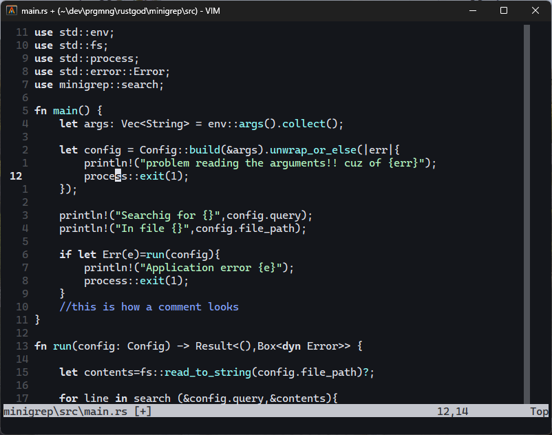

# quack.vim
The nvim's default dev_theme for vim
its not a exact copy , but looks almost the same and it is made it based of the builtin lunarperche colorscheme



### Installation

Copy `colors/quack` to `~/.vim/colors/` then add the following to
your `~/.vimrc` file:

```
colorscheme quack
```
