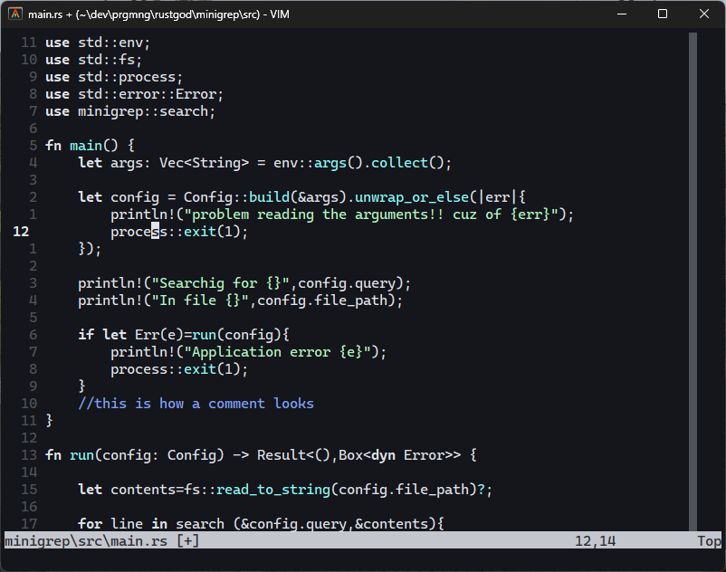

<h1 align="center">🎨 Quack.vim </h1>

<p align="center">
  You wanted dark theme?<br/>
  <i>You got it.</i>
</p>

<p align="center">
  
  
  
</p>

## Contents
<!-- toc -->
- [Theme example](#Theme-Example)
- [Introduction](#introduction)
- [Installation]()
<!-- tocstop -->


## Theme Example



## Introduction
**The nvim's default dev_theme for vim**

It is not a exact copy, *but looks almost the same* and it is made it __based of the builtin Lunarperche color scheme__

### Installation

- Using [vim-plug](https://github.com/junegunn/vim-plug)<br>
  Add this line to your `~/.vimrc`:<br>
   - `Plug 'chrnz008/quack.vim'`


### Manual installation

Write in your terminal:
```bash
git clone git@github.com:chrnz008/quack.vim.git
cd quack.vim
```

**Then add** the following to
your `~/.vimrc` file:<br>
`colorscheme quack`
